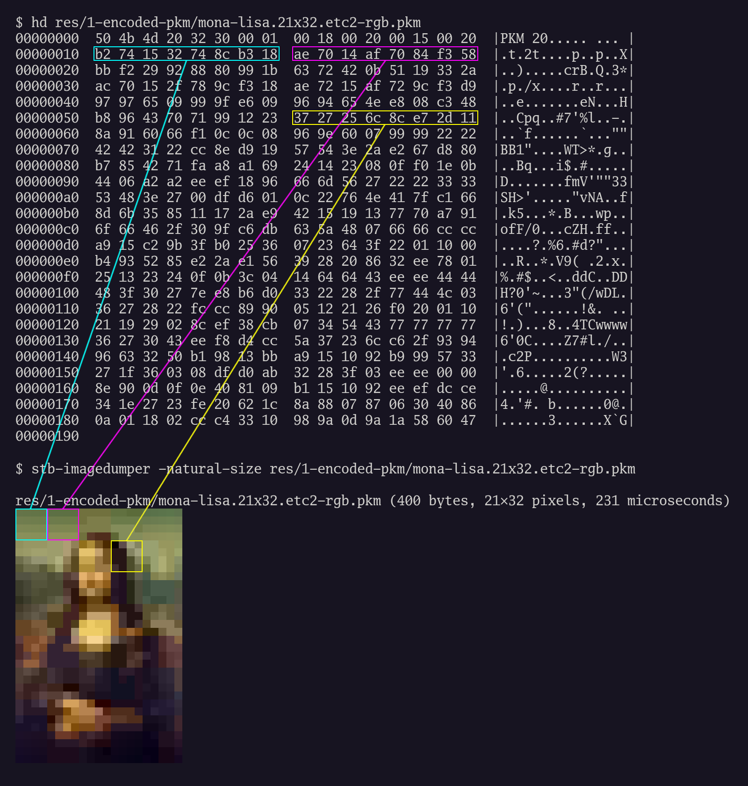

# ETC2

ETC (Ericsson Texture Compression) is a widely supported texture compression
format. It is a lossy, fixed-rate (4 bits per pixel; 64 bits = 8 bytes per 4×4
pixel block) image format. Each block is coded independently.

ETC (version 2) decoder support is mandatory in OpenGL ES 3.0+ / OpenGL 4.3+.
This Go package provides a software decoder (and encoder).

The PKM file format prepends a 16-byte header (containing the image width and
height and a magic signature) to ETC2 data.

## Mona Lisa Example

Here's an example PKM file, both as encoded bytes and as decoded pixels, marked
to show three 8-byte codes and their corresponding 4×4 pixel blocks. The
`stb-imagedumper` program is from the Wuffs repository, linked to below.

## ETC2 Specification

- https://registry.khronos.org/DataFormat/specs/1.3/dataformat.1.3.html#ETC2

## Other ETC Implementations

- https://github.com/SergeyMakeev/Goofy
- https://github.com/elasota/ConvectionKernels
- https://github.com/google/etc2comp
- https://github.com/google/wuffs
- https://github.com/nigeltao/ETCPACK
- https://github.com/nigeltao/etc1tool
- https://github.com/richgel999/rg-etc1
- https://github.com/wolfpld/etcpak

## Licence

Apache 2.
